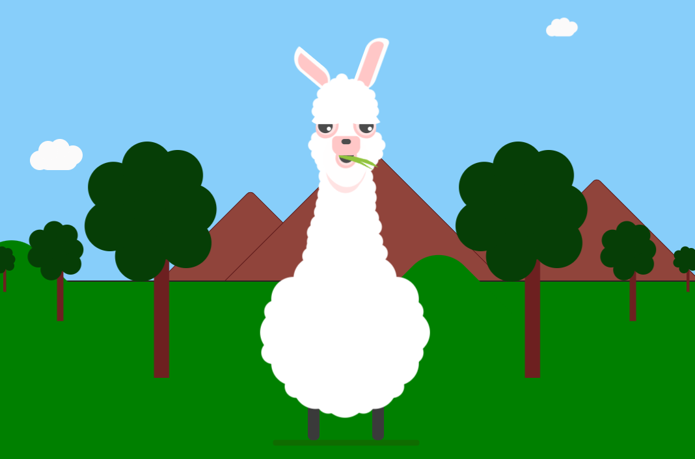

# PROJECT LLAMA - SCSS 


 #Dev

 1. Clone project
 2. Install dependencies
  ```
  npm install
  ``` 
 3. Run project
  ```
  gulp serve
  ```
 4. Build
  ```
  gulp build
  ```
## Vista Previa de la Imagen




  